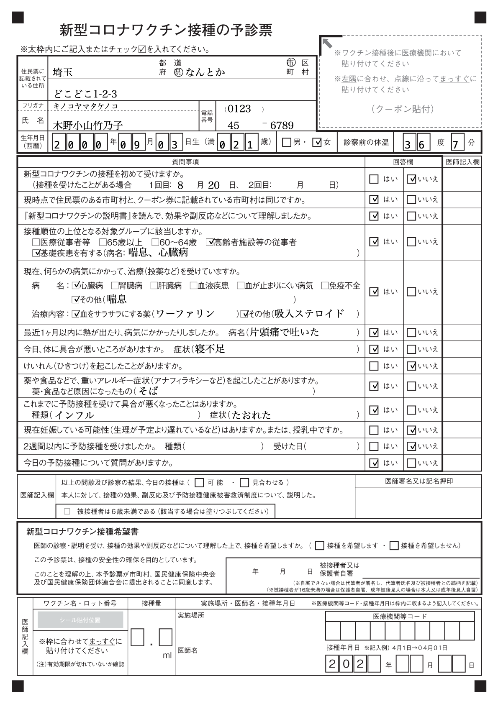

# 新型コロナワクチン接種の予診票の入力フォームを試作してみた

## これは何？
[このスレッド](https://twitter.com/tweeting_drtaka/status/1431952943771648001)を拝見して試しに作ってみたものです。
[フォーム](https://piyo-ko.github.io/prevaccination_questionnaire/index.html)に入力してボタンをタップすると、紙の予診票のレイアウトで記入済みの状態の PNG 画像を生成し、それをダウンロードします。

生成される画像の例:


## 注意事項
* 試作品なので、入力値のチェックもしていませんし、デバッグもあまりしていません。
* クライアントサイドの JavaScript のみで動きます。
* ダウンロードした PNG 画像をどう使うか、というところまではカバーしていません。
* [生成される画像の解像度の問題](https://developer.mozilla.org/ja/docs/Web/API/HTMLCanvasElement/toBlob)があるかもしれませんが、うまく解決できなかったのでとりあえず放置してあります。

## 予診票の画像について
[厚生労働省のサイト](https://www.mhlw.go.jp/stf/seisakunitsuite/bunya/vaccine_yoshinhyouetc.html#h2_free1)にある[予診票の PDF ファイル](https://www.mhlw.go.jp/content/000739379.pdf)をダウンロードし、それを macOS の「プレビュー」で変換した PNG 画像を使っています（ここでは `questionnaire.png` という名前で保存しました）。
うまくオプション設定できれば、ImageMagick でも使ってコマンドラインで良い感じのものを生成できるかと思いますが、詳しくないのでプレビューを使いました。
なお、厚生労働省の[「利用規約・リンク・著作権等」](https://www.mhlw.go.jp/chosakuken/index.html)から、このような形での加工・公開に著作権上の問題はなかろう、と判断しました。

##  欄外のヘッダーやフッターに何かが予め書かれている予診票を使いたい場合
予診票の画像 (`questionnaire.png`) は、A4 (210 mm × 297 mm) サイズで 144 dpi なので、1190 × 1683 ピクセルです。
欄外のヘッダーやフッターに何かが予め書かれている予診票 (職域接種で企業名が書かれている、など) を使う場合は、その予診票をこのサイズの PNG 画像に変換して `questionnaire.png` という名前で保存すれば (つまり`questionnaire.png` を差し替えれば)、他のファイル (`index.html` と `prevax.css` と `prevax.js`) はそのままで問題なく動くと思います。

## 印刷済みの予診票をプリンタにセットして使いたい場合
印刷済みの予診票をプリンタにセットして、記入内容のみをその上に印字したい場合もあるかもしれません。
その場合は、`prevax.js` の以下の一行を削除して運用すれば、透明な背景の上に記入内容の文字や印のみが描かれた画像がダウンロードできますので、それを印刷すれば何とかなるかと思います (が、実際の印刷での位置ずれの精度などの問題が多少はあるかもしれません)。

````
ctx.drawImage(bg_img, 0, 0, Width, Height);
````
